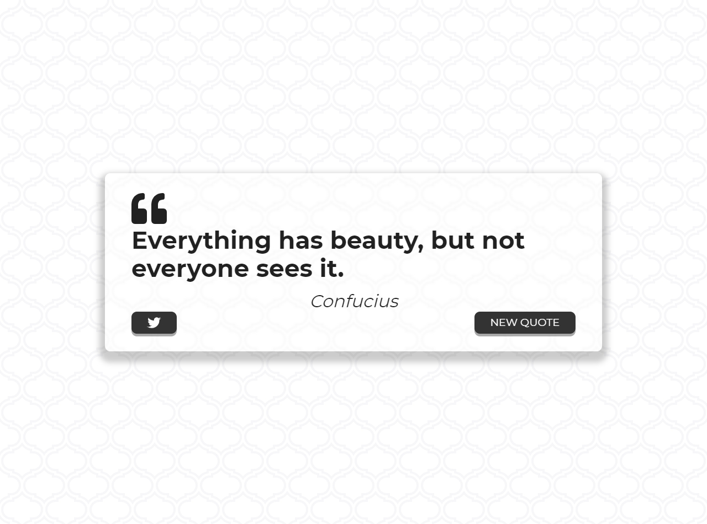
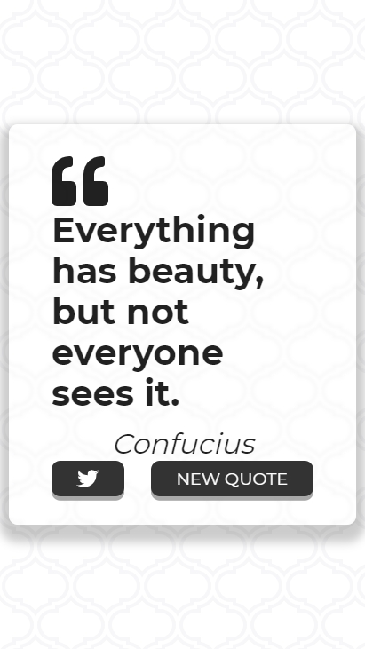

# Quote Generator

Generate a random quote and share the quote on twitter

# Demo

 

# Features

* Get random quote
* Tweet quote
* Progressive Web App

# Tools

* Framework [React](https://en.reactjs.org/) 
* Components from [Material UI](https://material-ui.com/)
* Fonts from [Fontawesome](https://fontawesome.com/)
* Quotes from [Forismatic](https://forismatic.com/en/)
* Background from [Hero Patterns](https://www.heropatterns.com/)

# Deployment

[Vercel](https://quote-generator.oscaramos.vercel.app/) 


# To run this app
1. Clone this repo
2. Run ```npm install```
3. Run ```npm start```

